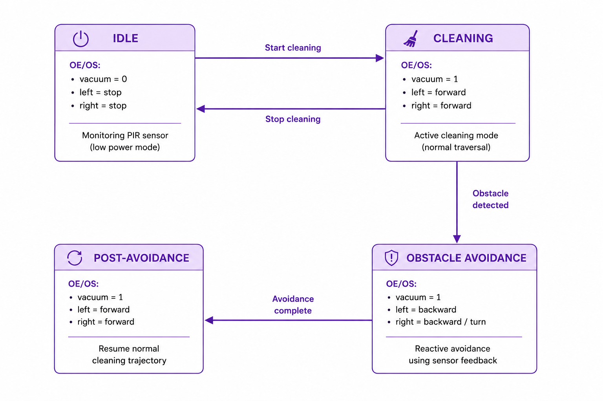

# Smart Vacuum Robot
Autonomous indoor cleaning robot with obstacle avoidance and computer vision using Raspberry Pi

━━━━━━━━━━━━━━ ✦ ✧ ✦ ━━━━━━━━━━━━━━

## 🟣 Overview

This project focuses on the design and implementation of a smart vacuum robot capable of autonomous indoor navigation and cleaning. The system is built on a Raspberry Pi and uses a finite state machine (FSM) with OE/OS architecture to control movement, obstacle avoidance, and vacuum operation.

Ultrasonic sensors provide real-time obstacle detection, while a camera module captures environmental snapshots during idle states. The robot demonstrates FSM-based decision-making, sensor fusion, and real-time motor control for autonomous cleaning.

  

## 🟣 Key Features

- OE/OS-based finite state machine control architecture
- Autonomous indoor navigation and cleaning
- Ultrasonic sensor-based obstacle detection (front + left)
- Real-time obstacle avoidance with recovery state
- PWM-controlled vacuum motor system
- Camera snapshot capture during idle state
- Time-based cleaning cycle (5s idle, 30s cleaning)
- Raspberry Pi GPIO-based motor control system

  

## 🔧 Hardware Components

| Component | Model | Quantity |
|-----------|-------|----------|
| Microcontroller | Raspberry Pi 5 | 1 |
| Camera Module | Pi Camera v2 | 1 |
| Motor Driver | L298N H-Bridge | 1 |
| DC Motors | Gear Motors | 2 |
| Ultrasonic Sensor | HC-SR04 | 2 |
| Vacuum Motor | DC Motor (PWM controlled) | 1 |
| Power Supply | 7.4V Battery Pack | 1 |

  

## 🟣 Pin Mapping

| Component | GPIO Configuration |
|----------|---------------------|
| Front Ultrasonic Sensor | Trigger: GPIO4, Echo: GPIO17 |
| Left Ultrasonic Sensor | Trigger: GPIO22, Echo: GPIO27 |
| Left Motor | Forward: GPIO14, Backward: GPIO15 |
| Right Motor | Forward: GPIO18, Backward: GPIO23 |
| Vacuum Motor | PWM: GPIO24 |

  

## 🟣 Finite State Machine (FSM)

The system is implemented using a deterministic OE/OS finite state machine with explicit transition states for obstacle handling.

### FSM Diagram

### States

- **OE_idle**
  - Stops all motors
  - Turns vacuum OFF
  - Transitions immediately to OS_idle

- **OS_idle**
  - Captures environment image (`idle.jpg`)
  - Waits 5 seconds
  - Transitions to OE_cleaning

- **OE_cleaning**
  - Activates vacuum motor
  - Starts forward movement
  - Transitions to OS_cleaning

- **OS_cleaning**
  - Continuous forward navigation
  - Monitors ultrasonic sensors
  - Obstacle detected → OE_obstacle_avoidance
  - After 30 seconds → OE_idle

- **OE_obstacle_avoidance**
  - Moves backward briefly (0.4s)
  - Transitions to OS_obstacle_avoidance

- **OS_obstacle_avoidance**
  - Executes right turn (0.5s)
  - Transitions to OE_post_avoidance

- **OE_post_avoidance**
  - Resumes forward motion
  - Returns to OS_cleaning

  

## 🟣 Control Logic Summary

- FSM controls all robot behavior transitions
- Ultrasonic sensors continuously monitor obstacle distance
- If distance < 0.25m → obstacle avoidance sequence is triggered
- Idle state captures image and waits 5 seconds before cleaning
- Cleaning cycle runs for 30 seconds before reset
- Post-avoidance state ensures stable recovery to cleaning mode

  

## 🟣 System Behavior Summary

- Fully autonomous indoor cleaning operation
- Real-time obstacle detection and avoidance
- Structured OE/OS FSM ensures predictable behavior
- Camera-based environmental snapshot logging
- Motor control managed via L298N driver
- Stable time-controlled cleaning cycles

  

## 🟣 Future Improvements

- Improve obstacle detection accuracy using sensor fusion filtering
- Add mapping or SLAM-based navigation
- Optimize path planning for full room coverage
- Replace reactive avoidance with intelligent navigation algorithm
- Integrate WiFi-based remote monitoring dashboard

  

## 🟣 Technologies Used

- Python 3
- gpiozero library
- picamera2
- Raspberry Pi OS
- HC-SR04 Ultrasonic Sensors
- L298N Motor Driver
